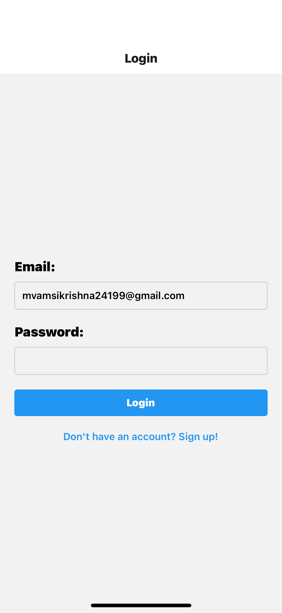
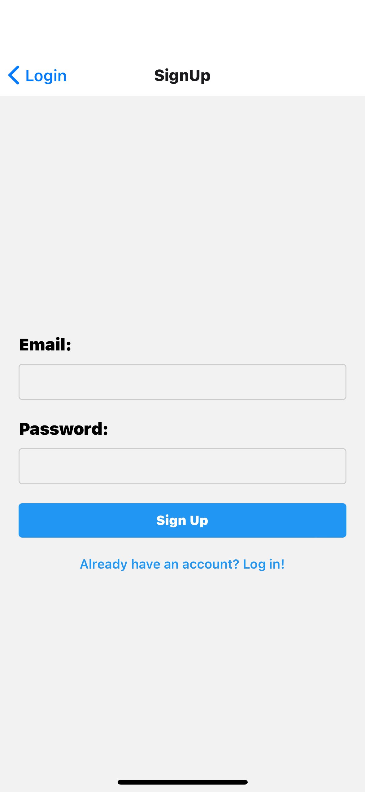
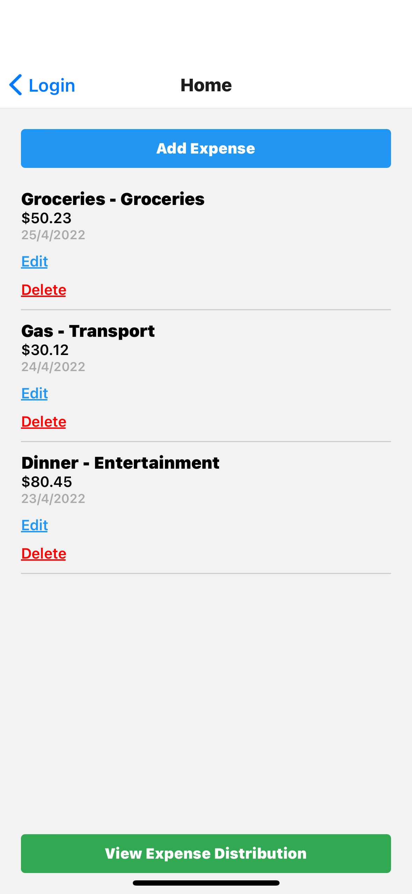
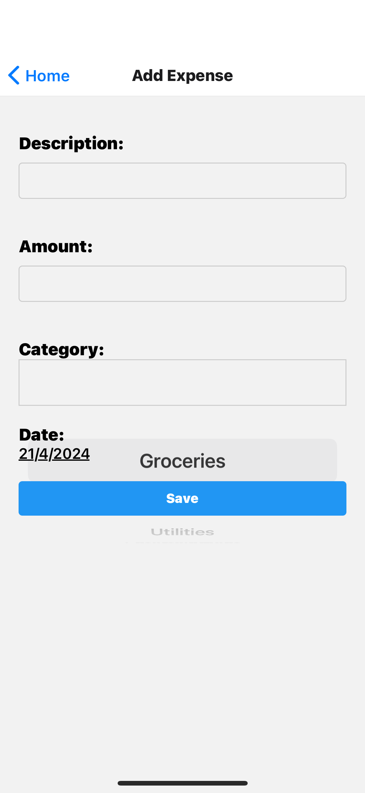
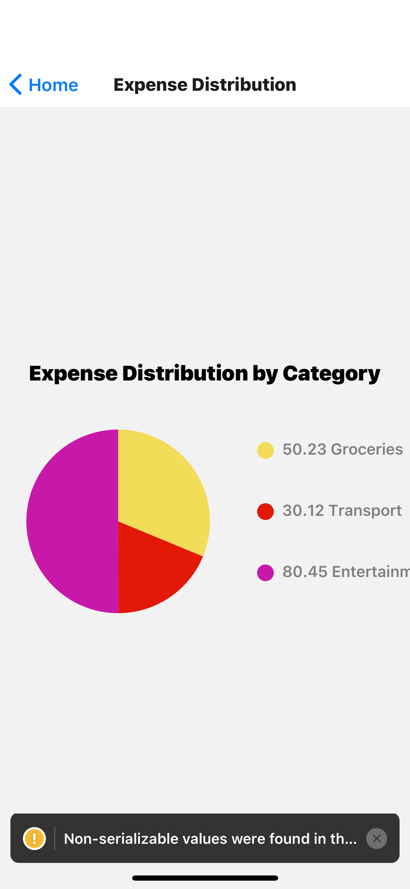

## Expense Tracker App

The Expense Tracker App is a comprehensive mobile application that empowers users to monitor, manage, and visualize their daily expenses. Designed with a simple and intuitive interface, the app makes it easy to keep track of where your money is going. It is built with React Native for cross-platform compatibility, ensuring a smooth experience on both iOS and Android devices.

### Core Features

**User Authentication**: Secure authentication allows users to create accounts and log in with their credentials, ensuring that expense data is kept private and personalized.
**Expense Management**:
**Add Expenses**: Log new expenses with key details like description, amount, date, and category. Users can select from predefined categories, ensuring consistent classification of expenses.
**Edit Expenses**: Make changes to existing expenses, such as updating the description, amount, date, or category.
**Delete Expenses**: Remove unwanted or incorrect expenses from the list.
**Expense Categorization**: Choose from a range of predefined categories, such as "Groceries," "Transport," "Utilities," "Entertainment," and "Other," to classify expenses. This feature aids in accurate visualization and reporting.
**Expense Visualization**: The app includes a pie chart to visualize expense distribution by category. This visualization helps users identify spending trends and make informed budgeting decisions.
**Intuitive Navigation**: The app uses React Navigation to provide seamless transitions between screens, creating a smooth user experience.

### Screens in Detail

1. **Login Screen**:
   - Allows users to log in with their email and password.
   - Includes a link to the sign-up screen for new users.
   - Provides basic validation to ensure credentials are entered correctly.
  

2. **Sign-Up Screen**:
   - New users can create an account by providing an email and password.
   - Includes basic input validation to ensure a valid email format and secure password.

3. **Home Screen**:
   - Displays a list of all recorded expenses.
   - Users can add new expenses or edit/delete existing ones.
   - The list shows key information for each expense, including description, category, amount, and date.
   - An additional button allows users to navigate to the pie chart to view expense distribution.

4. **Add Expense Screen**:
   - A form-based interface to add or edit expense details.
   - Includes fields for description, amount, date (with a date picker), and category (using a drop-down menu).
   - Validation ensures all necessary fields are filled in before saving.
   - When editing, users can see the current values and make changes.

5. **Pie Chart Screen**:
   - Visualizes expense distribution by category.
   - Uses `react-native-chart-kit` to create a pie chart.
   - The chart shows the proportion of expenses in each category, allowing users to see where their money is going.
   - Useful for identifying spending patterns and making budgeting decisions.

### Technical Details

**React Native**: The app is built with React Native, ensuring cross-platform compatibility and a native-like experience on both iOS and Android.
**React Navigation**: Provides screen navigation, enabling smooth transitions between different parts of the app.
**@react-native-picker/picker**: Used for creating drop-down lists, particularly for selecting expense categories.
**DateTimePicker**: A component for selecting dates when logging expenses.
**PieChart**: A visualization component from `react-native-chart-kit` for displaying expense data in a pie chart format.

### Use Cases

**Personal Budgeting**: Individuals can use the app to track their daily expenses, categorize them, and understand their spending patterns. This helps with personal budgeting and financial planning.
**Expense Visualization**: The pie chart feature allows users to visualize their spending by category, providing insights into where their money is going. This can help with identifying areas for cost-cutting or budgeting adjustments.
**Expense Management**: With the ability to add, edit, and delete expenses, users have full control over their expense data, allowing them to keep their records accurate and up to date.

### Conclusion

The Expense Tracker App is a user-friendly solution for managing personal expenses. With its intuitive interface, comprehensive features, and expense visualization capabilities, it provides a valuable tool for users looking to take control of their finances. Whether you're tracking daily spending or planning a budget, this app can help you stay organized and make informed financial decisions.
